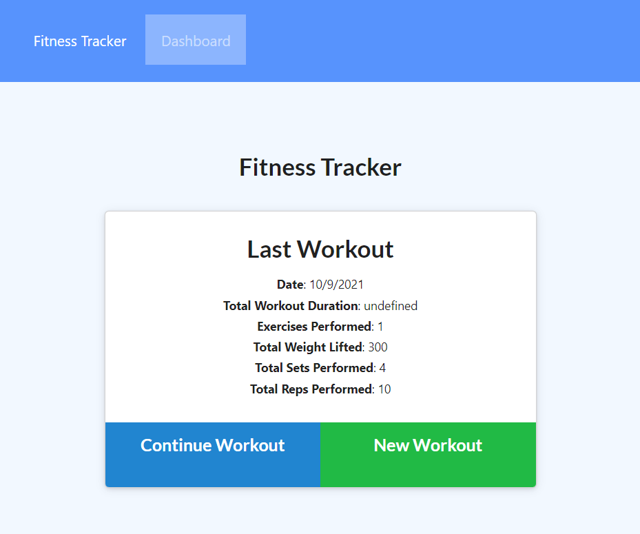

# 🏬 Fitness Tracker

Fitness Tracker is an workout web application that allows the user to create and track daily workouts.
  

## 🎯 Objectives

* Use **MongoDB** and **Mongoose**.
* Deploy web application to **Heroku**.
  

## 📚 _User Stories_
As a User I want to . . . . . . . . | So that I may . . . . . . . . . . . . . . 
----------------------------------- | ------------------------------------------
record the name of the exercise     | keep track of type of exercises performed
record the type of exercise         | keep track of the type of workouts created
record the weight, sets and reps    | keep track of weight lifting routines
record the duration of an exercise  | keep track of how much time spent
record cardio exercise              | know the distance travelled
 

## 🖼️ Wireframe
 

  

## 📹 Video Demonstration
<video controls width="80%" align="center" src="./public/images/Fitness Tracker.webm" type="video/webm"> 
    Sorry, your browser doesn't support embedded videos.
</video>